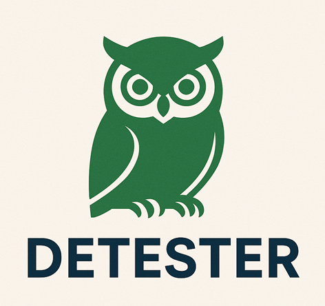

<p align="center"></p>

<div align="center">

[](https://www.nuget.org/packages/Detester/)
[](https://github.com/sa-es-ir/Detester/stargazers)
</div>

# Detester

Detester is a .NET library that enables you to write deterministic tests for AI-powered applications. It provides a fluent builder API for testing AI responses, ensuring consistency and reliability in your AI integrations.

## Features

- **Fluent Builder API**: Chain multiple prompts and assertions in a readable, intuitive way
- **Any AI Provider Support**: Works with any `IChatClient` implementation (OpenAI, Azure OpenAI, Ollama, etc.)
- **Model Instructions**: Set system messages to guide model behavior and responses
- **Response Validation**: Assert that AI responses contain expected keywords or text
- **Function/Tool Call Verification**: Verify that AI models call the correct functions with expected parameters
- **JSON Response Validation**: Deserialize and validate JSON responses from AI models with type-safe validation
- **Method Chaining**: Combine multiple prompts and assertions in a single test flow
- **Extensible**: Build on Microsoft.Extensions.AI abstractions for maximum flexibility

## Installation

```bash
dotnet add package Detester
```

For OpenAI or Azure OpenAI support, also install:
```bash
dotnet add package Microsoft.Extensions.AI.OpenAI
dotnet add package Azure.AI.OpenAI
```

## Quick Start
[Check out the Wiki page for a detailed documentation](https://github.com/sa-es-ir/detester/wiki)

### Using Azure OpenAI

```csharp
using Azure.AI.OpenAI;
using Detester;
using Microsoft.Extensions.AI;
using System.ClientModel;

// Create Azure OpenAI client and wrap it as IChatClient
var azureClient = new AzureOpenAIClient(
    new Uri("https://your-resource.openai.azure.com"),
    new ApiKeyCredential("your-azure-api-key"));
var chatClient = azureClient.GetChatClient("gpt-4-deployment").AsIChatClient();

// Create a builder with the chat client
var builder = DetesterFactory.Create(chatClient);

// Or create a builder with ChatOptions (to configure tools, behavior, and settings)
var builder = DetesterFactory.Create(chatClient, new ChatOptions {/*setup*/});

// Execute a test
await builder
    .WithPrompt("Explain quantum computing in simple terms")
    .ShouldContainResponse("quantum")
    .AssertAsync();
```

### Using Any IChatClient

Detester works with any `IChatClient` implementation from `Microsoft.Extensions.AI`:

```csharp
using Detester;
using Microsoft.Extensions.AI;

// Use any IChatClient implementation (OpenAI, Azure OpenAI, Ollama, custom, etc.)
IChatClient chatClient = // your chat client implementation
var builder = DetesterFactory.Create(chatClient);

await builder
    .WithPrompt("Test prompt")
    .ShouldContainResponse("expected text")
    .AssertAsync();
```

## Advanced Usage

### Setting Model Instructions

Set custom instructions (system messages) to guide the model's behavior:

```csharp
await new DetesterBuilder(chatClient)
    .WithInstruction("Answer concisely.")
    .WithPrompt("Summarize this long text you've provided.")
    .ShouldContainResponse("summary")
    .ShouldContainAll("short", "summary")
    .ShouldContainAny("tl;dr", "summary", "in short")
    .ShouldNotContainResponse("error")
    .ShouldNotContain("stack trace")
    .ShouldNotContainAnyResponse("SECRET_KEY", "password")
    .ShouldMatchRegex(@"^[A-Z].+")
    .ShouldBeEqualTo("Exact match", StringComparison.OrdinalIgnoreCase) // if you want strict equality
    .AssertAsync();
```

### Multiple Prompts

Test conversational flows by chaining multiple prompts:

```csharp
await builder
    .WithPrompt("Hello, I need help with coding")
    .WithPrompt("Can you explain what a variable is?")
    .ShouldContainResponse("variable")
    .AssertAsync();
```
### OR Assertions

Use `OrShouldContainResponse` to create flexible response validation where at least one of the alternatives must match:

```csharp
await builder
    .WithPrompt("What is the capital of France?")
    .ShouldContainResponse("capital")
    .OrShouldContainResponse("city")
    .OrShouldContainResponse("Paris")
    .AssertAsync();
```

In this example, the test passes if the response contains "capital" OR "city" OR "Paris". You can chain multiple OR conditions, and the test will pass if any one of them is found in the response.

### JSON Response Validation

Detester supports validating JSON responses from AI models by deserializing them to C# types and optionally validating the deserialized objects. This is useful for testing structured outputs from language models.

#### Basic JSON Validation

Verify that the response can be deserialized to a specific type:

```csharp
public class User
{
    public string? FirstName { get; set; }
    public string? LastName { get; set; }
    public int Age { get; set; }
    public DateTime JoinDate { get; set; }
}

await builder
    .WithPrompt("Who is the last user joined?")
    .ShouldHaveJsonOfType<User>(new JsonSerializerOptions { PropertyNameCaseInsensitive = true })
    .AssertAsync();
```

#### JSON Validation with Custom Validation

Add custom validation logic to verify the deserialized object:

```csharp
await builder
    .WithPrompt("Who is the last user joined?")
    .ShouldHaveJsonOfType<User>(
        new JsonSerializerOptions { PropertyNameCaseInsensitive = true },
        user => user.Age > 30 && user.FirstName!.Contains("Jo"))
    .AssertAsync();
```

#### Complex JSON Validation

Combine multiple validations:

```csharp
await builder
    .WithPrompt("Get user details")
    .ShouldContainResponse("Joe")  // Text assertion
    .ShouldHaveJsonOfType<User>(
        new JsonSerializerOptions { PropertyNameCaseInsensitive = true },
        user => user.Age > 18)  // JSON validation
    .ShouldHaveJsonOfType<User>(
        new JsonSerializerOptions { PropertyNameCaseInsensitive = true },
        user => user.LastName == "Doe")  // Additional JSON validation
    .AssertAsync();
```

**Note:** 
- The JSON validation uses `System.Text.Json` for deserialization
- Deserialization exceptions are caught and wrapped in `DetesterException` with helpful error messages
- If validation fails, the test throws `DetesterException` with details about what went wrong
- For case-insensitive property name matching, use `JsonSerializerOptions { PropertyNameCaseInsensitive = true }`

### Function/Tool Call Verification

Detester supports verifying that AI models call the correct functions/tools with expected parameters. This is useful for testing AI applications that use function calling capabilities.

#### Basic Function Call Verification

Verify that a specific function is called:

```csharp
await builder
    .WithPrompt("What's the weather in Paris?")
    .ShouldCallFunction("get_weather")
    .AssertAsync();
```

#### Verify Function Parameters

Check that functions are called with the correct parameters:

```csharp
await builder
    .WithPrompt("What's the weather in Paris in celsius?")
    .ShouldCallFunctionWithParameters("get_weather", 
        new Dictionary<string, object?> 
        { 
            { "location", "Paris" },
            { "units", "celsius" }
        })
    .AssertAsync();
```

#### Multiple Function Calls

Verify multiple function calls in a single response:

```csharp
await builder
    .WithPrompt("Compare the weather in Paris and London")
    .ShouldCallFunction("get_weather")
    .ShouldCallFunction("get_weather")
    .AssertAsync();
```

#### Combined Verification

Combine function call verification with text response assertions:

```csharp
await builder
    .WithPrompt("What's the capital of France?")
    .ShouldCallFunction("get_capital")
    .ShouldContainResponse("Paris")
    .AssertAsync();
```

For more detailed information and examples, see the [Function Calling Guide](docs/function-calling-guide.md).

## Error Handling

Detester throws `DetesterException` when:
- No prompts are provided before execution
- Expected text is not found in the response
- None of the OR alternatives are found in the response
- Expected function call is not found
- JSON deserialization fails or validation fails

Detester throws `InvalidOperationException` when:
- `OrShouldContainResponse` is called without a prior assertion

Example:

```csharp
try
{
    await builder
        .WithPrompt("What is AI?")
        .ShouldContainResponse("impossible text that won't appear")
        .AssertAsync();
}
catch (DetesterException ex)
{
    Console.WriteLine($"Test failed: {ex.Message}");
}
```

## Contributing

Contributions are welcome! Please feel free to submit a Pull Request.

## License

This project is licensed under the MIT License.

## Acknowledgments

Built on top of [Microsoft.Extensions.AI](https://www.nuget.org/packages/Microsoft.Extensions.AI) for seamless integration with AI services.
